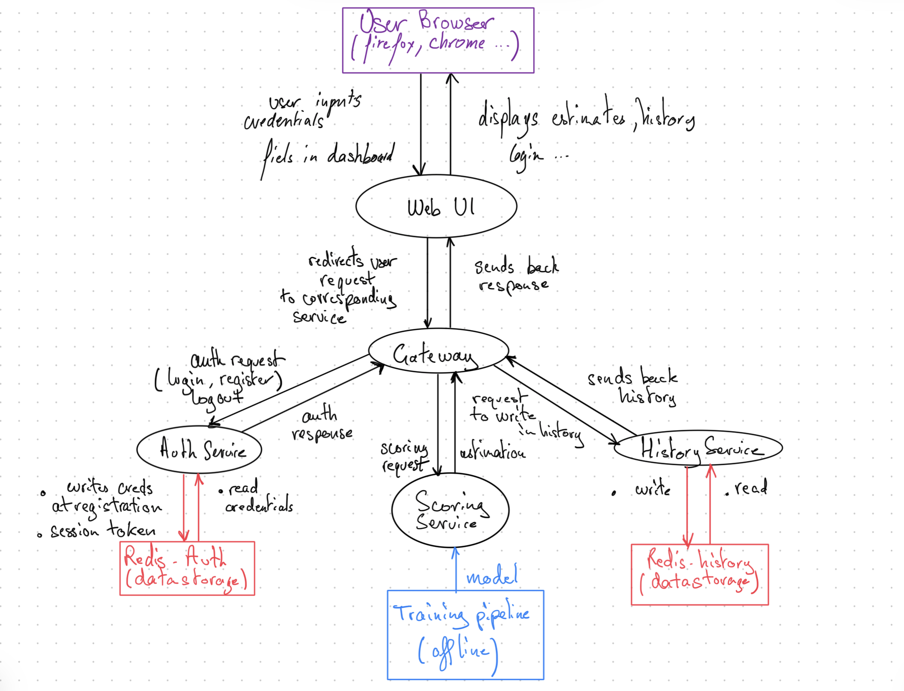

# Architecture

## Navigation
Go back [Main page - Readme](../README.md)
Other pages:
- [Detailed functionnalities](product.md)
- [Machine Learning for Property Scoring](scoring.md)
- [Authentication and security](security.md)

## Overview

The application is built as a set of independent services, each responsible for a single
concern/function.

The following documentation aims to explain why Microservices are coherent in this tool's case and how this architecture is implemented.

## Microservice Architecture
### Why a Microservices Architecture ?

The application was designed as a microservices architecture rather than a single monolithic
code. This is both a technical and knowledge availability choice.

First of all, in our case a microservice architecture shows benefits:
- **Independent deployability and resilience**: each service (auth, scoring, history) can be updated, rebuilt, or restarted without affecting the others. In practice this means the scoring model can be swapped or retrained without touching user authentication or history.
- **Shows clear separation of concerns**: each service has a single responsibility and exposes its own API. This makes the codebase easier to read/reason about and reduces the risk of unintended side effects when making changes in some parts of the code.
- **Is easily scalable**: in the same way, if the scoring service becomes a bottleneck like being under heavy load or performances no longer alligned on the tool goals, it can be scaled independently without scaling the entire application.
- **Service-oriented delivery**: the tool is a valuation service used through an API. A microservices architecture is meant for that. For example, the scoring service could be exposed directly to clients (like a real estate platform) without making any changes to the overall logic of the tool.

**Identified limitations of microservices:**
This architecture creates complexity that may not be justified for a small internal tool. Managing multiple services, multiple databases, and between-service communication requires more infrastructure "discipline" than a "one does it all" application. In a production context this complexity can be mitigated by using a container orchestration software like Kubernetes.

**Previous knowledge**: I(/the team) have worked on some other projects involving the use of redis and microservices in a web context. Thus this prior knowledge is being leveraged for a similar web-based service delivery context.

### Map of all services

Functionnaly, the services are the following:

| Service | Responsibility/Concern |
|---|---|
| `auth` | User registration, login, logout |
| `scoring-api` | Trained model loading and property value prediction |
| `history` | Saving and retrieving users own estimates |
| `gateway` | Single entry point that routes request to the right services |
| `webui` | Authentication page and user dashboard, directly exposed to the user's browser |
| `redis-auth` | User and session storage (owned by auth service) |
| `redis-history` | Estimate storage (history by user) |

Their interactions are better explained by a schema:

## Using Redis as database / datastorage

Redis is used as the persistent database for two services. Those databases are separated by concerns as implied by the microservice architecture.

Redis has some nice qualities:

- **Speed**: Redis is an in-memory datastorage. It makes reading and writing operations much quicker than a proper database architecture like PostgreSQL, MongoDB...
- **Simplicity**: Redis datastorage doesn't require a set in stone data format, which saves time and decreases complexity.
- **Built-in expiry**: Redis natively supports key expiration, which we use to automatically invalidate user sessions after 24 hours without any additional logic (again time and complexity).

**Why two separate instances:**
Sharing a single Redis instance between services would violate the core microservices principle that each service owns its data. If auth and history share a datastorage, a bug or format change in one service can corrupt data used by the other. Two instances provide true isolation.

**Persistence:**
Both Redis instances are configured with persistence enabled, which means user accounts and estimate history are stored in a file and will survive tool restarts and rebuilds.

## Logging
Each service implements a loggin system to help for debugging and explainability. The python file implementing the logging pipeline is in each of the services folder as per microservice principle of separation of concerns. That way, logging can be tailored differently for each service.

Logs are accessible by running  the following commands in the terminal:
- `python cli.py logs` for logs from all services
- `python cli.py logs auth` for example to see logs from auth only
- `python cli.py logs scoring-api` for example to see logs from scoring-api only