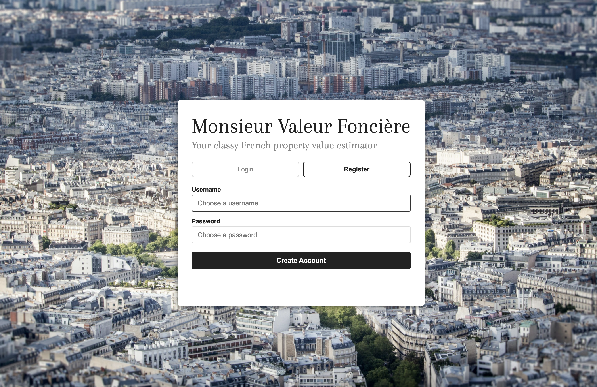
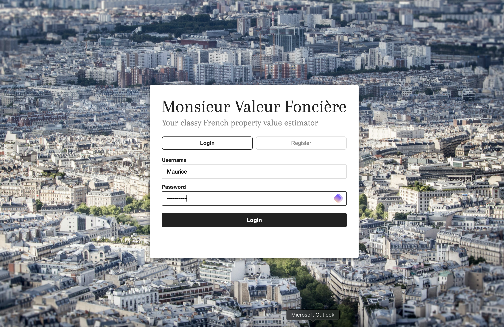
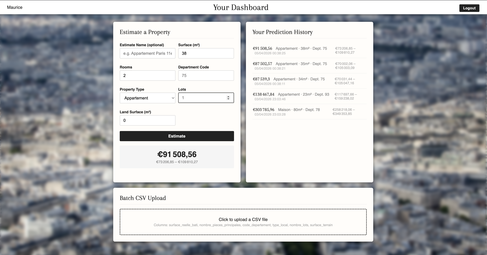
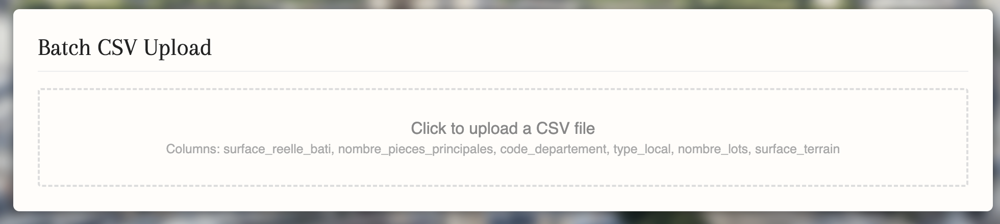
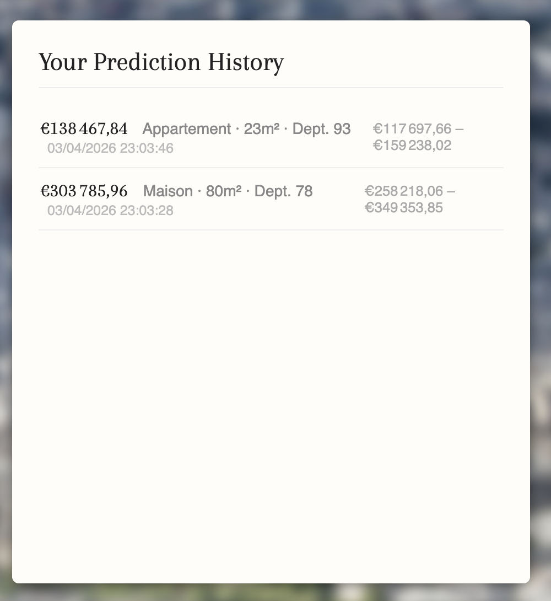

# Detailed functionnalities

## Navigation
Go back [Main page - Readme](../README.md)
Other pages:
- [Architecture](architecture.md)
- [Machine Learning for Property Scoring](scoring.md)
- [Authentication and security](security.md)

## User Stories
_These user-stories are not too complex but help see how someone would use the tool._

### As an individual
_These are some user-stories for the tool aimed at non professional individuals:_
- As someone looking to sell my apartment, I want to get a quick order-of-magnitude estimate of my appartment valuation so that I can enter conversations with agents with a informed baseline in mind.
- As a buyer, I want to gauge whether a property asking price is in a reasonable range compared to what the data suggests, before committing to a professional valuation/appraisal.
- As a property owner, I want to consult my past estimates so that I can keep track of the properties I have looked at over time.

### As a real estate professional
_These are some user-stories for the tool aimed at professional in the real estate market:_
- As a real estate agent, I want to test a list of properties and get rough estimates for all of them at once so that I can quickly filter a portfolio and prioritise which ones should deserve a mroe comprehensive valuation.
- As a real estate analyst, I want to retrieve past estimates so that I can compare rough valuations across different searches over time.

## Features

### Account
Users can create and account (i.e register) and login into their own account. A user's session spans 24h and is stopped past this delay. The user will need to login again afterward.

Account registration screen:

Login screen:

### Single Property Estimate
The core feature of the tool. The user can fill in a short form with the following property details:

| Field | Description |
|---|---|
| Surface (m²) | Built surface area of the property |
| Rooms | Number of main rooms |
| Department Code | French department (like 75 for Paris) |
| Property Type | Maison or Appartement |
| Lots | Number of lots |
| Land Surface (m²) | Total land area (relevant for houses) |

The tool will then return an estimated value in euros along with a price range which reflects the uncertainty of the estimate.

Dashboard with a prediction made

### Batch Estimation
For professional use cases, the user can upload a CSV file containing multiple properties. The tool processes all rows and returns an estimate for each one. The CSV must contain the same fields as the single estimation form.

Area for batch estimation (importing a CSV file):

### History
Every estimate is automatically saved to the user's account. The history panel displays past estimates with the input details, the predicted value, the price range, and the date of the estimate. History persist across sessions.

Estimations history:

