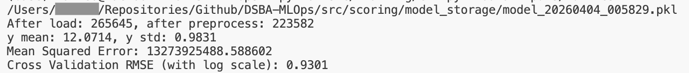

# Machine Learning for Property Scoring

## Navigation
Go back [Main page - Readme](../README.md)
Other pages:
- [Detailed functionnalities](product.md)
- [Architecture](architecture.md)
- [Authentication and security](security.md)

## Content
The goal is to predict the declared value (valeur foncière) of a French property given a setof descriptive attributes.

This is a supervised regression problem where given  a set of inputs describing a property, the model outputs an estimated value in euros.

The model is trained on the DVF dataset (Demandes de Valeurs Foncières), published by the DGFIP and the Ministry of Economy, Finance and Industry, which covers all declared property values across metropolitan France and DOM TOM, except Alsace and Moselle. 

The dataset can be downloaded as a CSV file [here](https://www.data.gouv.fr/datasets/demandes-de-valeurs-foncieres-geolocalisees). Download the `.csv` file (_csv/YEAR/full.csv.gz_). The closest year record should be chosen so estimates are more inline with current property valuation.

### The data

The DVF dataset contains mant features. Only ones that are atomic (cannot be described by another) or too descriptive for the geographic scope (department) are kept for use in the machine learning pipeline. For example, `ville` (city) or `numero_de_rue` (street number) are more descriptive than `code_departement` and might "clutter" the model during learning phase. Also, for security reasons, we don't want the user to input their adress in the system. Indeed very personal/sensitive informations need higher level of database securtiy which is out of the current project scope of giving a rough-instant estimate of property value.
In the same way, `id_parcelle` (parcel identifier) and dates intuitively don't seem to impact the property value and will be dropped.

The kept features are:

| Feature | Description |
|---|---|
| `surface_reelle_bati` | Built surface area (m²) |
| `nombre_pieces_principales` | Number of main rooms |
| `code_departement` | French department code |
| `type_local` | Property type (Maison / Appartement) |
| `nombre_lots` | Number of lots |
| `surface_terrain` | Land surface area (m²) |

A few key data decisions worth noting:

- **Outlier filtering**: properties above the 90th percentile (like some in Paris) of declared value are excluded from training. These exceptional properties have shown to hurt model error rates a lot.
- **Department vs postal code**: we use `code_departement` (97 unique values) rather than `code_postal` (5800+ unique values). At postal code granularity, most codes have too few training examples to be a reliable pattern for the model to learn from.

### Model Choice

The too implements a **HistGradientBoostingRegressor** (from __scikit-learn__) for the following reasons:

1. **Gradient boosting** is known to perform well on structured tabular data with mixed features types (dates, ids, prices, names...)
2. the histogram-based variant is significantly faster than classic gradient boosting, making retraining practical on the extensive full-France dataset

On training results:
Lauching the training CLI gives the following output in the terminal:


(these are results for one training on 2025 data for all France)

| Metric | Value |
|---|---|
| Training samples | 223 582 (out of 265 645 after filtering) |
| MSE (test set) | 13 273 925 488 euros |
| CV RMSE (log scale) | 0.9301 |

The MSE represents the error squared, **which makes the value seem really big. In practice, predictions are typically within + or - 20% of the actual declared value** (for a 200 000 euros property the estimate would be between 160 000 and 240 000 euros. The cross-validation score (CV RMSE) of 0.93 shows the model can predict a 2.5x higher or lower than the true property price. **This is good enough to present a value bracket indication, but shouldn't (and is not meant to) be used as a precise valuation.**

### Price Range

The tool includes a price range for each estimate (like 180 000 euros to 220 000 euros) that is directly based on the training results discussed before.

The range is computed as **+ or - 20% around the predicted value**. It is a simplification and not a statistically derived confidence interval. This is intended to communicate to the user that the estimate carries uncertainty. It is consistent with the observed average error during on the test set (training phase) and should be read as a **rough indicative bracket and not a guarantee**.


### Retraining the Model

The model can be retrained at any moment using the training CLI. The scoring service will load the most recently trained model at startup.

```python cli.py train --data inputs/full.csv```
The trained model is saved as a timestamped `.pkl` file in `src/scoring/model_storage/`.

